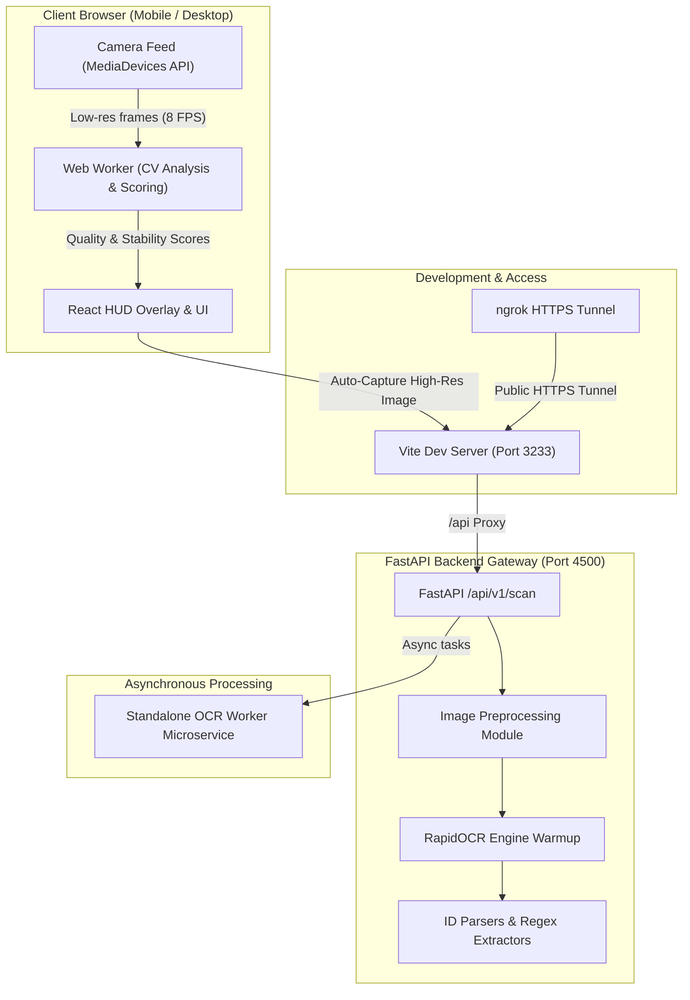
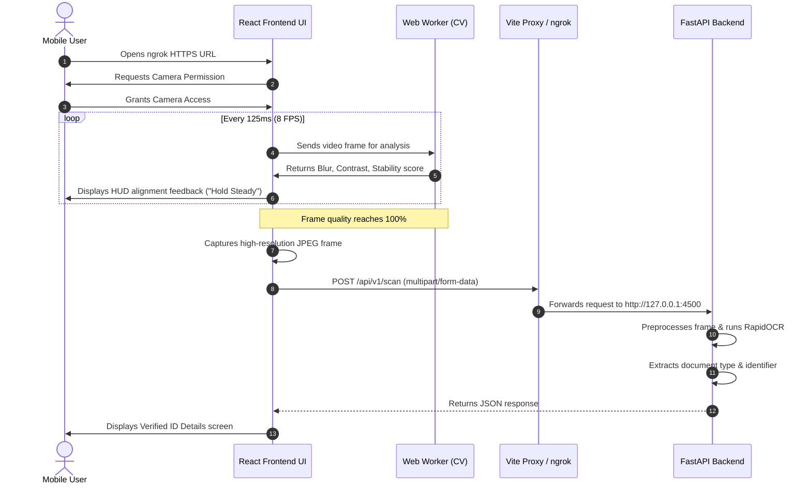

# Mobile Identity Document Scanner - Project Documentation

Welcome to the comprehensive technical documentation for the **Mobile Identity Document Scanner**. This project provides a real-time, privacy-focused mobile document scanning and OCR (Optical Character Recognition) pipeline designed to extract structured data from official government identity documents (Aadhaar, PAN, Driving License, Passport, Voter ID, etc.).

---

## 📌 Executive Summary

The **Mobile Identity Document Scanner** resolves key friction points in mobile document scanning by pairing **edge-side real-time Computer Vision analysis** inside a Web Worker with a **high-accuracy server-side OCR engine** powered by RapidOCR.

- **Real-Time Quality Check**: Analyzes frame stability, blur level, contrast, and document framing directly on the client prior to capture.
- **Automatic Capture**: Automatically triggers high-resolution image capture once consecutive frame stability reaches 100%.
- **High Confidence OCR**: Runs server-side RapidOCR models with custom extraction rules tailored for Indian and international identity cards.
- **Seamless Local & Public Development**: Features automatic **ngrok integration** in Vite dev server (`npm run dev`), serving instant HTTPS tunnels for testing mobile camera feeds on physical devices.

---

## 🏗️ Architecture & Component Overview



---

## 💻 Tech Stack

### 1. Frontend Client
- **Framework**: React 19 + TypeScript
- **Build Tool**: Vite 8 (with custom Vite ngrok plugin)
- **Styling**: Modern dark mode CSS with responsive glassmorphism HUD overlays
- **Computer Vision**: In-browser Canvas API & Web Worker frame processing (blur, contrast, brightness, and bounding box stability)

### 2. Backend Gateway
- **Framework**: Python 3.10+ & FastAPI
- **Server**: Uvicorn ASGI server running on port `4500`
- **OCR Engine**: RapidOCR (`ch_PP-OCRv4` ONNX runtime execution)
- **Validation Engine**: Pydantic v2 schemas and customized document regex parsers

### 3. OCR Microservice Worker
- **Containerization**: Docker / Docker Compose
- **Service**: Standalone Python OCR execution environment for scaling scan workloads

---

## 📂 Repository Structure

```
IDScanner/
├── backend/                  # FastAPI Backend Application
│   ├── app/
│   │   ├── api/              # API Endpoints (/api/v1/scan, /health)
│   │   ├── core/             # Configuration & Environment Settings
│   │   ├── extractors/       # Document-specific regex & rule extractors
│   │   ├── ocr/              # RapidOCR engine wrapper & warmup logic
│   │   ├── preprocessing/    # Contrast adjustment & thresholding
│   │   ├── schemas/          # Pydantic data schemas
│   │   └── validators/       # Identifier validation utilities
│   ├── benchmark/            # Load testing & performance scripts
│   └── main.py               # Backend entrypoint (uvicorn listener)
│
├── frontend/                 # React 19 + Vite Frontend Application
│   ├── src/
│   │   ├── scanner/
│   │   │   ├── components/   # ScannerContainer, ScannerOverlay, ScannerHUD
│   │   │   ├── cv/           # Computer vision scoring algorithm
│   │   │   ├── hooks/        # useCamera hook
│   │   │   └── worker.ts     # Off-thread Web Worker analyzer
│   │   ├── App.tsx
│   │   └── index.css         # Styling and design system
│   ├── vite.config.ts        # Vite configuration + auto ngrok launcher plugin
│   └── package.json
│
├── ocr_worker/               # Standalone OCR Microservice Container
│   ├── app/
│   │   └── main.py
│   ├── Dockerfile
│   └── requirements.txt
│
├── sdk/                      # Embeddable Web SDK Package
│   └── package.json
│
├── .env                      # Environment Variables configuration
├── .env.example              # Template Environment file
├── docker-compose.yml        # Docker orchestrator
├── ngrok.exe                 # ngrok binary for tunnel creation
└── PROJECT_DOCUMENTATION.md  # Comprehensive project reference
```

---

## 🔧 Environment Configuration (`.env`)

Create or update your `.env` file in the project root with the following parameters:

```env
APP_ENV=development
LOG_LEVEL=INFO
CORS_ORIGINS='["http://localhost", "http://localhost:80", "http://localhost:3233"]'
MAX_IMAGE_SIZE_MB=5
OCR_MODEL=ch_PP-OCRv4
OCR_DEVICE=cpu
OCR_WORKERS=1
HIGH_CONFIDENCE_THRESHOLD=0.90
RETRY_THRESHOLD=0.75
API_TIMEOUT_SECONDS=30
API_HOST=0.0.0.0
API_PORT=8000
NGROK_AUTHTOKEN=3BPNLBbYxBMzrEDwZMa3RpQTEcP_2BrSJFMa1YxcHpbNg2hSG
```

---

## 🚀 Quick Start Guide

### Prerequisites
- **Node.js**: v18+ and `npm`
- **Python**: v3.10+ with `pip`
- **ngrok**: (Binary included in project root: `ngrok.exe`)

---

### Step 1: Start Backend API Server

Navigate to the `backend` folder and launch Uvicorn:

```powershell
cd backend
python -m uvicorn app.main:app --host 0.0.0.0 --port 4500 --reload
```

---

### Step 2: Start Frontend Application (with Auto ngrok Tunnel)

Navigate to the `frontend` folder and start Vite:

```powershell
cd frontend
npm run dev
```

> **Automatic ngrok Tunneling**:
> The `vite.config.ts` script includes an integrated plugin (`ngrokPlugin`). Running `npm run dev` automatically spawns `ngrok http 3233` and prints the public HTTPS URL in your terminal:
>
> ```
>   ➜  Local:   http://localhost:3233/
>   ➜  Network: http://10.10.14.249:3233/
>   ➜  ngrok:   https://maybell-basifixed-nonsubversively.ngrok-free.dev
> ```

---

## 🔄 Scanning & OCR Workflow



---

## 🛰️ API Reference Summary

### 1. Health Check
- **Endpoint**: `GET /health`
- **Response**:
```json
{
  "status": "healthy",
  "ocr_engine": "ready",
  "version": "1.0.0"
}
```

### 2. Scan Document
- **Endpoint**: `POST /api/v1/scan`
- **Content-Type**: `multipart/form-data`
- **Parameters**: `file` (JPEG / PNG binary image)
- **Response**:
```json
{
  "success": true,
  "document_type": "Aadhaar Card",
  "identifier": "1234 5678 9012",
  "confidence": 0.94,
  "requires_rescan": false,
  "raw_text": "GOVERNMENT OF INDIA 1234 5678 9012"
}
```

---

## 🛠️ Testing & Quality Assurance

### Frontend Tests
Run unit tests for computer vision frame scoring:
```powershell
cd frontend
npm test
```

### Backend Tests
Run pytest suite for API schema validation and OCR parsing:
```powershell
cd backend
pytest
```

---

<!-- \\\\\\\\\\\\\\\\\\\\\\\\\\\\\\\\\\\\\\\\\\\\\\\\\\\\\\\\\\\\\\\\\\\\\\\\\\\\\\\\\\\\\\\\\\\\\\\\\\\\\\\\\\\\\\\\\\\\\\\\\\\\\\\\\\\\ -->

<!-- 1. Frontend Level (User Camera -> Image Blob) -->
Mobile ya desktop browser me camera feed se image banai jaati hai:
<!--  -->
Live Camera Stream: HTML5 navigator.mediaDevices.getUserMedia se live camera feed liya jata hai.
Quality & Stability Check: Real-time Web Worker video frame analyze karke framing, blur level aur stability check karta hai.
JPEG Blob Generation: Jab stability 100% ho jaati hai, image ko HTML <canvas> par render karke binary JPEG Blob (image/jpeg) create kiya jata hai.
FormData Payload: Binary blob ko FormData ke andhar 'file' key ke sath attach karke backend par bheja jata hai.
Code Reference (

ScannerContainer.tsx
):

typescript
canvas.toBlob(async (blob) => {
  if (!blob) return;
  const formData = new FormData();
  formData.append('file', blob, 'capture.jpg'); // Binary JPEG file
  const response = await fetch('/api/v1/scan', {
    method: 'POST',
    body: formData // multipart/form-data
  });
}, 'image/jpeg', 0.9);
2. Backend Level (FastAPI -> Memory Decoding)
FastAPI backend server is multipart request ko bina disk par save kiye directly RAM (In-Memory) me decode karta hai:

UploadFile Receiver: /api/v1/scan endpoint UploadFile = File(...) se binary stream read karta hai.
Supported Formats: image/jpeg, image/png, image/webp.
OpenCV Memory Decoding: Raw binary byte array ko np.frombuffer aur cv2.imdecode dwara OpenCV Image Matrix me convert kiya jata hai (Zero Disk I/O).
Code Reference (

scan.py
):

python
# 1. Binary Content Read
content = await upload_file.read()
# 2. In-Memory Image Decoding (Zero disk I/O)
np_arr = np.frombuffer(content, np.uint8)
img = cv2.imdecode(np_arr, cv2.IMREAD_COLOR) # OpenCV BGR Numpy Array
Summary Matrix
Stage	Data Format	Tech Used
User Camera	Video Frame / Canvas	MediaDevices API
Client Transport	Binary Blob (image/jpeg) in FormData	multipart/form-data
Backend API	UploadFile Binary Bytes	FastAPI File(...)
OCR Processing	OpenCV numpy.ndarray (BGR)	RapidOCR (ONNX runtime)


## 📄 License & Attribution

Distributed under the MIT License. Developed for high-performance identity document verification workflows.


## ⚙️ Microservice Architecture: `ocr_worker`

The `ocr_worker` directory contains an independent Python microservice that encapsulates the heavy AI processing workload (PaddleOCR) away from the main backend.

### How it Works:
1. **Model Warmup**: On startup (`lifespan` in `main.py`), it initializes the heavy `PaddleOCR` model in memory and performs a dummy scan to warm up the engine so the first real request is fast.
2. **Dedicated API endpoint**: It runs its own FastAPI server (port 8001) exposing a `/scan` POST endpoint. 
3. **In-Memory Decoding**: It receives binary image streams (`UploadFile`), decodes them using OpenCV, and optionally applies adaptive thresholding (`engine.py`) to clean up shadows before feeding the matrix to PaddleOCR.
4. **Data Extraction**: It extracts text lines, bounding boxes, and confidence scores, and returns them as a clean JSON response.

### How it is Used in the Project:
- **Decoupling**: Currently, the main API backend handles both API requests and regex/parsing logic. The `ocr_worker` allows us to extract the OCR engine into a dedicated service.
- **Horizontal Scalability**: PaddleOCR requires significant RAM and CPU/GPU. By decoupling it, you can run multiple instances (pods) of the `ocr_worker` on separate servers (or GPUs) while keeping the main backend lightweight.
- **Integration**: The main backend (`backend/app/api/v1/scan.py`) will act as a gateway—receiving the image from the React frontend, sending it to the `ocr_worker` via an internal network request, and then parsing the returned text with regex extractors.
